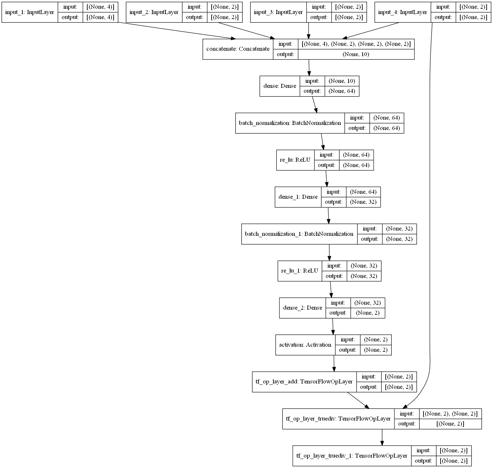

Touch Extrapolation MLP
===

The dataset to train neural networks which extrapolate the movement of a finger on a touchscreen was collected by Henze et al.[1-2]. You can find more details on their papers or [repository](https://github.com/interactionlab/MobileHCI17-Touch-Extrapolation).

## Model Diagram

## Result

The experiments were conducted on varying window sizes. Our experiments showed that window size of 11 gives the lowest prediction error.

| window size | MSE | RMSE |
|-|-|-|
| 3 | 160.80 | 12.68 |
| 4 | 20.96 | 4.58 |
| 5 | 17.46 | 4.18 |
| 6 | 0.37 | 0.61 |
| 7 | 1.60 | 1.26 |
| 8 | 0.55 | 0.74 |
| 9 | 0.07 | 0.27 |
| 10 | 0.12 | 0.34 |
| **11** | **0.04** | **0.20** |
| 12 | 0.54 | 0.74 |
| 13 | 0.03 | 0.16 |

## Prerequisites

- tensorflow r1.13
- matplotlib
- numpy

## References

[1] Niels Henze, Markus Funk, Alireza Sahami Shirazi: Software-reduced touchscreen latency. Proceedings of the International Conference on Human-Computer Interaction with Mobile Devices and Services, 2016.

[2] Niels Henze, Huy Viet Le, Sven Mayer, Valentin Schwind: Improving Software-Reduced Touchscreen Latency. Adjunct Proceedings of the International Conference on Human-Computer Interaction with Mobile Devices and Services, 2017.